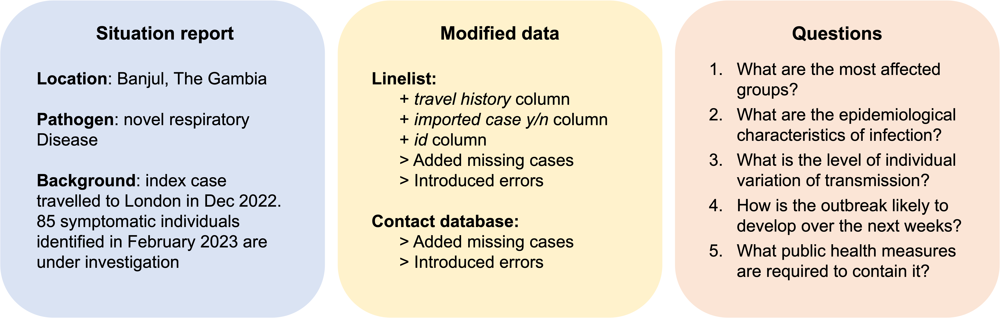
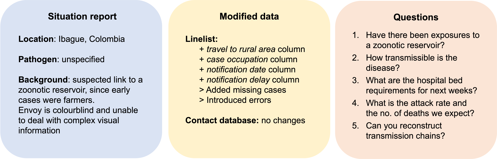
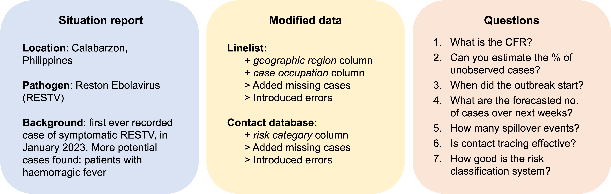
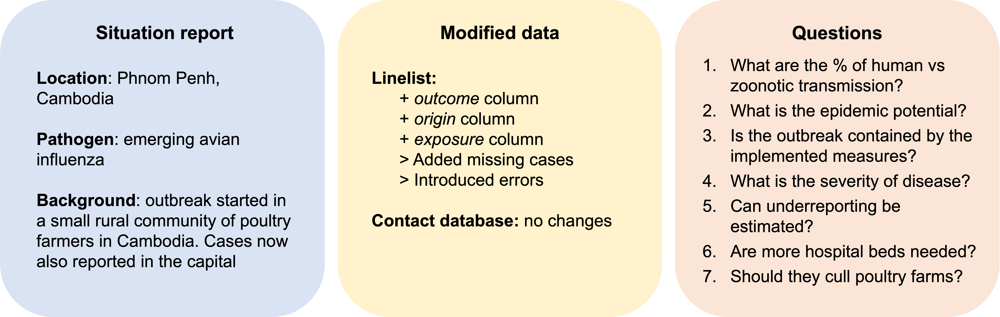
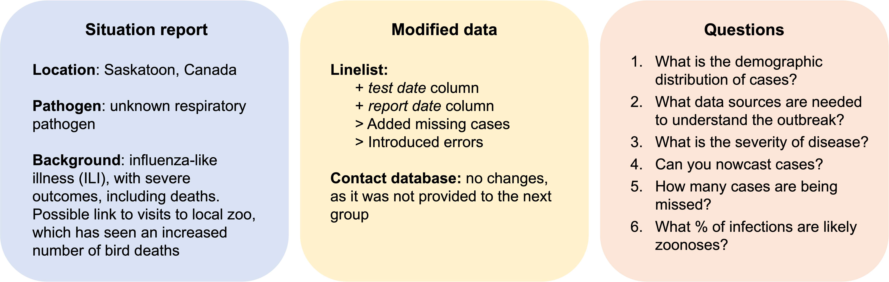

 

This vignette summarises the findings from the *100 days and 100 lines
of code* workshop, hosted in December 2022 by
[Epiverse-TRACE](https://data.org/news/epiverse-trace-a-values-based-approach-to-open-source-ecosystems/).

**This document is a draft, the final version will be published on Epiverse's blog after it has been reviewed by other Epiverse members and workshop participants** 

## What should the first 100 lines of code written during an epidemic look like?

To answer this question, we invited 40 experts, including academics,
field epidemiologists, and software engineers, to take part in a 3-day
workshop, where they discussed the current challenges, and potential
solutions, in data analytic pipelines used to analyse epidemic data.

### What R packages and tools are available to use during an epidemic?

To investigate this in a similar setting to what an outbreak response
team would experience, workshop participants were divided into groups,
and asked to develop a plausible epidemic scenario, that included:

-   A situation report, describing the characteristics of the epidemic

-   A linelist of cases and contact tracing data, by modifying provided
    datasets containing simulated data

-   A set of questions to address during the analytic process

Groups then exchanged epidemic scenarios and analysed the provided data
to answer the questions indicated the previous group, as if they were a
response team working to solve an outbreak. Details about each of these
outbreak scenarios and the analytic pipelines developed by the groups
are summarised in this vignette.

### Simulating epidemic data

Before the workshop, a fictitious dataset was created, which consisted
of a linelist and contact tracing information.

To generate linelist data, the package
[`bpmodels`](https://github.com/epiverse-trace/bpmodels) was used to
generate a branching process network. Cases were then transformed from
the model output to a linelist format. To add plausible hospitalisations
and deaths, delay distributions for SARS-CoV were extracted from
[`epiparameter`](https://github.com/epiverse-trace/epiparameter).

To create the contact tracing database, a random number of contacts was
generated for each of the cases included in the linelist. These contacts
were then assigned a category of *became case*, *under follow up* or
*lost to follow up*, at random.

-   Through this workshop, we identified the need for a tool to simulate
    outbreak data in a linelist format, to test analysis methods and
    other packages while having control over the characteristics of the
    test data. For this purpose, an R package is currently in progress,
    see [simulist](https://github.com/epiverse-trace/pitcher/issues/7).

## Scenario 1: Novel respiratory disease in The Gambia

    

### Analytic pipeline for scenario 1 (analysed by group 2)

-   Data cleaning

    -   [`linelist`](https://cran.r-project.org/web/packages/linelist/index.html)
        to standardise date format
    -   [`cleanr`](https://github.com/Hackout3/cleanr) from previous
        Hackathon

-   Delay distributions

    -   [`fitdisrplus`](https://cran.r-project.org/web/packages/fitdistrplus/index.html)
        to fit parameteric distributions to scenario data
    -   [`epiparameter`](https://github.com/epiverse-trace/epiparameter)
        to extract delay distributions from respiratory pathogens
    -   [`EpiNow2`](https://github.com/epiforecasts/EpiNow2) to fit
        reporting delays
    -   [`EpiEstim`](https://cran.r-project.org/web/packages/EpiEstim/index.html)
        /
        [`coarseDataTools`](https://cran.r-project.org/web/packages/coarseDataTools/index.html)
        to estimate incubation period of disease
    -   [`epicontacts`](https://cran.r-project.org/web/packages/epicontacts/index.html)
    -   [`mixdiff`](https://github.com/MJomaba/MixDiff)

-   Population demographics

    -   Would like to have had access to an R package similar to
        [`ColOpenData`](https://github.com/biomac-lab/TRACE_ColOpenData)

-   Risk factors of infection

    -   Used
        [R4epis](https://r4epis.netlify.app/training/walk-through/univariate/)
        as a guide on how to create two-way tables and perform
        Chi-squared tests

-   Severity of disease

    -   [`datadelay`](https://github.com/epiverse-trace/datadelay/) for
        CFR calculation
    -   Implementation of method developed by [AC Ghani,
        2005](https://pubmed.ncbi.nlm.nih.gov/16076827/) to estimate CFR

-   Contact matching

    -   [`diyar`](https://cran.r-project.org/web/packages/diyar/index.html)
        to match and link records
    -   [`fuzzyjoin`](https://cran.r-project.org/web/packages/fuzzyjoin/index.html)
        to join contact and case data despite misspellings or missing
        cell contents

-   Epi curve and maps

    -   Used
        [`incidence`](https://cran.r-project.org/web/packages/incidence/)
        and
        [`incidence2`](https://cran.r-project.org/web/packages/incidence2/)
        for incidence calculation and visualisation
    -   [`raster`](https://cran.r-project.org/web/packages/raster/index.html)
        to extract spatial information from library of shapefiles

-   Reproduction number

    -   [`APEestim`](https://github.com/kpzoo/APEestim)
    -   [`bayEStim`](https://github.com/thlytras/bayEStim)
    -   [`earlyR`](https://cran.r-project.org/web/packages/earlyR/index.html)
    -   [`epicontacts`](https://cran.r-project.org/web/packages/epicontacts/index.html)
    -   [`epidemia`](https://github.com/ImperialCollegeLondon/epidemia)
    -   [`epiFilter`](https://github.com/kpzoo/EpiFilter)
    -   [`EpiNow2`](https://github.com/epiforecasts/EpiNow2)
    -   [`EpiEstim`](https://cran.r-project.org/web/packages/EpiEstim/index.html)
    -   [`R0`](https://cran.r-project.org/web/packages/R0/index.html)
    -   [`outbreaker2`](https://cran.r-project.org/web/packages/outbreaker2/index.html)
    -   Used [this comparison
        table](https://github.com/mrc-ide/EpiEstim/blob/master/vignettes/alternative_software.Rmd)
        to choose the most appropriate package.

-   Superspreading, by using these resources:

    -   [`fitdistrplus`](https://cran.r-project.org/web/packages/fitdistrplus/index.html)
    -   [`epicontacts`](https://cran.r-project.org/web/packages/epicontacts/index.html)

-   Epidemic projections

    -   [`incidence`](https://cran.r-project.org/web/packages/incidence/vignettes/incidence_fit_class.html)
        R estimation using a loglinear model
    -   [`projections`](https://cran.r-project.org/web/packages/projections/index.html)
        using Rt estimates, SI distributions and overdispersion
        estimates

-   Transmission chains and strain characterisation

    -   [IQtree](http://www.iqtree.org) and
        [nextclade](https://clades.nextstrain.org) to build a maximum
        likelihood tree and mannually inspect it
    -   Advanced modelling through phylodynamic methods, using tools
        like [BEAST](https://beast.community)

 

<table>
<colgroup>
<col style="width: 25%" />
<col style="width: 75%" />
</colgroup>
<thead>
<tr class="header">
<th>Data analysis step</th>
<th>Challenges</th>
</tr>
</thead>
<tbody>
<tr class="odd">
<td>Data cleaning</td>
<td>Not knowing what packages are available for this purpose</td>
</tr>
<tr class="even">
<td>Delay distributions</td>
<td>Dealing with right censoring   Accounting for multiple
infectors</td>
</tr>
<tr class="odd">
<td>Population demographics</td>
<td>Lacking tools that provide information about population by age,
gender, etc.</td>
</tr>
<tr class="even">
<td>Risk factors of infection</td>
<td>Distinguishing between risk factors vs detecting differences in
reporting frequencies among groups</td>
</tr>
<tr class="odd">
<td>Severity of disease</td>
<td>Knowing the prevalence of disease (denominator)   Right censoring
  Varying severity of different strains</td>
</tr>
<tr class="even">
<td>Contact matching</td>
<td>Missing data   Misspellings</td>
</tr>
<tr class="odd">
<td>Epicurve and maps</td>
<td>NA dates entries not included   Reporting levels varying over
time</td>
</tr>
<tr class="even">
<td>Offspring distribution</td>
<td>Right censoring   Time varying reporting efforts   Assumption
of a single homogeneous epidemic   Importation of cases</td>
</tr>
<tr class="odd">
<td>Forecasting</td>
<td>Underlying assumption of a given R distribution, e.g., single trend,
homogeneous mixing, no saturation</td>
</tr>
</tbody>
</table>

 

## Scenario 2: Outbreak of an unidentified disease in rural Colombia

 

  

### Analytic pipeline for scenario 2 (analysed by group 3)

-   Data cleaning: manually, using R (no packages specified), to
    -   Fix data entry issues in columns *onset\_date* and *gender*
    -   Check for missing data
    -   Check sequence of dates: symptom onset → hospitalisation → death
-   Data anonymisation to share with partners
    -   [`fastlink`](https://cran.r-project.org/web/packages/fastLink/index.html)
        for probabilistic matching between cases ↔ contacts, based on
        names, dates, and ages
-   Case demographics
    -   [`apyramid`](https://cran.r-project.org/web/packages/apyramid/index.html)
        to stratify data by age, gender, and health status
-   Reproductive number calculation, by using two approaches:
    -   Manually, by calculating the number of cases generated by each
        source case, data management through
        [`dplyr`](https://dplyr.tidyverse.org) and
        [`data.table`](https://cran.r-project.org/web/packages/data.table/index.html)
    -   Using serial interval of disease, through
        [`EpiEstim`](https://cran.r-project.org/web/packages/EpiEstim/index.html)
        or [`EpiNow2`](https://github.com/epiforecasts/EpiNow2)
-   Severity of disease
    -   Manual calculation of CFR and hospitalisation ratio
-   Projection of hospital bed requirements
    -   [`EpiNow2`](https://github.com/epiforecasts/EpiNow2) to
        calculate average hospitalisation duration and forecasting
-   Zoonotic transmission of disease
    -   Manual inspection of cases’ occupation
    -   Use of [IQtree](http://www.iqtree.org) and
        [`ggtree`](https://guangchuangyu.github.io/software/ggtree/) to
        plot phylogenetic data
-   Superspreading
    -   [`epicontacts`](https://cran.r-project.org/web/packages/epicontacts/index.html)
-   Calculation of attack rate
    -   Unable to calculate, given the lack of seroprevalence data

 

<table>
<colgroup>
<col style="width: 25%" />
<col style="width: 75%" />
</colgroup>
<thead>
<tr class="header">
<th>Data analysis step</th>
<th>Challenges</th>
</tr>
</thead>
<tbody>
<tr class="odd">
<td>Data anonymisation</td>
<td>Dealing with typos and missing data when generating random unique
identifiers</td>
</tr>
<tr class="even">
<td>Reproduction number</td>
<td>Right censoring   Underestimation of cases due to reporting
delays</td>
</tr>
<tr class="odd">
<td>Projection of hospital bed requirements</td>
<td>Incomplete data (missing discharge date)   Undocumented
functionality in R packages used</td>
</tr>
<tr class="even">
<td>Zoonotic transmission</td>
<td>Poor documentation   Unavailability of packages in R  
Differentiation between zoonotic transmission and risk factors- need for
population data</td>
</tr>
<tr class="odd">
<td>Attack rate</td>
<td>Not enough information provided</td>
</tr>
</tbody>
</table>

## Scenario 3: Reston Ebolavirus in the Philippines

 

 

### Analytic pipeline for scenario 3 (analysed by group 4)

-   Data cleaning
    -   Importing data with
        [`rio`](https://cran.r-project.org/web/packages/rio/index.html),
        [`readxl`](https://readxl.tidyverse.org),
        [`readr`](https://cran.r-project.org/web/packages/readr/index.html),
        or
        [`openxlsx`](https://cran.r-project.org/web/packages/openxlsx/index.html)
    -   Rename variables with
        [`janitor`](https://cran.r-project.org/web/packages/janitor/index.html)
    -   Initial data checks with
        [`pointblank`](https://cran.r-project.org/web/packages/pointblank/index.html),
        [`assertr`](https://cran.r-project.org/web/packages/assertr/index.html),
        [`compareDF`](https://cran.r-project.org/web/packages/compareDF/index.html),
        or
        [`skimr`](https://cran.r-project.org/web/packages/skimr/index.html)
    -   Vertical data checks with
        [`matchmaker`](https://cran.rstudio.com/web/packages/matchmaker/index.html),
        [`lubridate`](https://cran.r-project.org/web/packages/lubridate/index.html),
        or
        [`parsedate`](https://cran.r-project.org/web/packages/parsedate/index.html)
    -   Horizontal data checks with
        [`hmatch`](https://github.com/epicentre-msf/hmatch),
        [`assertr`](https://cran.r-project.org/web/packages/assertr/index.html),
        or [`queryR`](https://github.com/epicentre-msf/queryr)
    -   Detect duplicates with
        [`janitor`](https://cran.r-project.org/web/packages/janitor/index.html)
        and [`tidyverse`](https://www.tidyverse.org)
    -   Checking for consistency with
        [`dplyr`](https://dplyr.tidyverse.org), or
        [`powerjoin`](https://cran.r-project.org/web/packages/powerjoin/index.html)
    -   Translation with
        [`matchmaker`](https://cran.rstudio.com/web/packages/matchmaker/index.html)
-   Delay distributions
    -   [`fitdistrplus`](https://cran.r-project.org/web/packages/fitdistrplus/index.html)
        to fit parameteric distributions to epidemic data
-   Case demographics
    -   [`apyramid`](https://cran.r-project.org/web/packages/apyramid/index.html)
        to stratify data by age, gender, and health status
    -   [`ggplot2`](https://ggplot2.tidyverse.org/reference/ggplot.html)
        to visualise data
-   Outbreak description
    -   [`sitrep`](https://github.com/R4EPI/sitrep) to generate reports
-   Visualisation of geographic data
    -   [`sf`](https://cran.r-project.org/web/packages/sf/index.html)
        for static maps
    -   [`leaflet`](https://cran.r-project.org/web/packages/leaflet/index.html)
        for interactive maps
-   Generation of tables
    -   [`gtsummary`](https://cran.r-project.org/web/packages/gtsummary/index.html)
        for static tables
    -   [`janitor`](https://cran.r-project.org/web/packages/janitor/index.html)
        for interactive tables
-   Severity of disease
    -   [`EpiNow2`](https://epiforecasts.io/EpiNow2/) and
        [`survival`](https://cran.r-project.org/web/packages/survival/index.html)
        to calculate CFR
-   Attack rate
    -   [`gadm`](https://github.com/rspatial/geodata) function to get
        population data
    -   [`epitabulate`](https://github.com/R4EPI/epitabulate/) to
        describe data
    -   [`sf`](https://cran.r-project.org/web/packages/sf/index.html)
        and
        [`ggplot2`](https://ggplot2.tidyverse.org/reference/ggplot.html)
        to plot data
-   Forecasting
    -   [`EpiEstim`](https://cran.r-project.org/web/packages/EpiEstim/index.html)
    -   [`EpiNow2`](https://epiforecasts.io/EpiNow2/)
    -   [`bpmodels`](https://github.com/epiverse-trace/bpmodels)
-   Spillover events
    -   By cross-referencing contact data with occupations
-   Effectiveness of contact tracing
    -   By calculating the proportion of case follow-ups and comparing
        the delay of disease exposure to the follow-up delay
-   Transmission trees
    -   [`epicontacts`](https://cran.r-project.org/web/packages/epicontacts/index.html)
    -   [`ggplot2`](https://ggplot2.tidyverse.org/reference/ggplot.html)

 

<table>
<thead>
<tr class="header">
<th>Data analysis step</th>
<th>Challenges</th>
</tr>
</thead>
<tbody>
<tr class="odd">
<td>Detection of outliers</td>
<td>No known tools to use</td>
</tr>
<tr class="even">
<td>Severity of disease</td>
<td>Censoring</td>
</tr>
<tr class="odd">
<td>Spillover events</td>
<td>Missing data</td>
</tr>
</tbody>
</table>

 

## Scenario 4: Emerging avian influenza in Cambodia

 

 

### Analytic pipeline for scenario 4 (analysed by group 5)

-   Data cleaning
    -   [`readxl`](https://readxl.tidyverse.org) to import data
    -   [`dplyr`](https://dplyr.tidyverse.org) to remove names
    -   Manually scanning through excel to check for errors
-   Reproduction number
    -   [`EpiEstim`](https://cran.r-project.org/web/packages/EpiEstim/index.html)
-   Severity of disease
    -   Manually using R to detect missing cases
    -   [`epiR`](https://cran.r-project.org/web/packages/epiR/index.html)
        to check for data censoring

 

<table>
<colgroup>
<col style="width: 25%" />
<col style="width: 75%" />
</colgroup>
<thead>
<tr class="header">
<th>Data analysis step</th>
<th>Challenges</th>
</tr>
</thead>
<tbody>
<tr class="odd">
<td>Data cleaning</td>
<td>No available R packages specific for epidemic data</td>
</tr>
<tr class="even">
<td>Reproduction number</td>
<td>Difficulty finding parameter estimations in the literature</td>
</tr>
<tr class="odd">
<td>Severity</td>
<td>Missing cases   Need for an R package for systematic censoring
analysis</td>
</tr>
</tbody>
</table>

 

## Scenario 5: Outbreak of respiratory disease in Canada

 

 

### Analytic pipeline for scenario 5 (analysed by group 1)

-   Define project structure
    -   Defining the script’s structure with
        [`cookiecutter`](https://github.com/jacobcvt12/cookiecutter-R-package),
        [`reportfactory`](https://cran.r-project.org/web/packages/reportfactory/index.html),
        and
        [`orderly`](https://cran.rstudio.com/web/packages/orderly/index.html)
    -   Ensuring reproducibility of the analysis with
        [iRODS](https://irods.org) and [Git](https://git-scm.com)
    -   Working in a group with [GitHub](https://github.com)
-   Data cleaning
    -   Importing data with
        [`readr`](https://cran.r-project.org/web/packages/readr/index.html)
        or
        [`rio`](https://cran.r-project.org/web/packages/rio/index.html)
    -   Checking for errors with
        [`linelist`](https://cran.r-project.org/web/packages/linelist/index.html),
        [`janitor`](https://cran.r-project.org/web/packages/janitor/index.html),
        [`parsedate`](https://cran.r-project.org/web/packages/parsedate/index.html),
        [`matchmaker`](https://cran.rstudio.com/web/packages/matchmaker/index.html),
        or
        [`lubridate`](https://cran.r-project.org/web/packages/lubridate/index.html)
    -   [`janitor`](https://cran.r-project.org/web/packages/janitor/index.html)
        to eliminate duplicates
    -   [`naniar`](https://cran.r-project.org/web/packages/naniar/index.html)
        to check for missing data
    -   [`epitrix`](https://cran.r-project.org/web/packages/epitrix/index.html)
        to anonymise data
-   Delay distributions
    -   [`epitrix`](https://cran.r-project.org/web/packages/epitrix/index.html)
    -   [`fitdistrplus`](https://cran.r-project.org/web/packages/fitdistrplus/index.html)
        to fit parameteric distributions to scenario data
-   Case demographics
    -   [`apyramid`](https://cran.r-project.org/web/packages/apyramid/index.html)
        to stratify data by age, gender, and health status
-   Nowcasting
    -   [`incidence2`](https://cran.r-project.org/web/packages/incidence2/vignettes/Introduction.html)
        to visualise incidence from linelist data
    -   [`epiparameter`](https://github.com/epiverse-trace/epiparameter)
        to extract infectious disease parameter data
    -   [`EpiEstim`](https://cran.r-project.org/web/packages/EpiEstim/index.html)
        or [`EpiNow2`](https://github.com/epiforecasts/EpiNow2) for Rt
        calculation
-   Severity of disease
    -   Calculation of hospitalisation and mortality rates- no R package
        specified
-   Zoonotic transmission
    -   [`forecast`](https://cran.r-project.org/web/packages/forecast/index.html)
-   Generation of reports
    -   [`incidence`](https://cran.r-project.org/web/packages/incidence/vignettes/overview.html)
        for static reports
    -   [Quarto](https://quarto.org) and [R
        markdown](https://rmarkdown.rstudio.com) for dashboards

 

<table>
<colgroup>
<col style="width: 25%" />
<col style="width: 75%" />
</colgroup>
<thead>
<tr class="header">
<th>Data analysis step</th>
<th>Challenges</th>
</tr>
</thead>
<tbody>
<tr class="odd">
<td>Project structure</td>
<td>Working simultaneously on the same script and managing parallel
tasks   Anticipating future incoming data in early pipeline
design</td>
</tr>
<tr class="even">
<td>Data cleaning</td>
<td>Large amount of code lines used on (reasonably) predictable cleaning
(e.g. data sense checks)   Omitting too many data entries when simply
removing <em>NA</em> rows   Non standardised data formats  
Implementing rapid quality check reports before analysis</td>
</tr>
<tr class="odd">
<td>Delay distributions</td>
<td>Identifying the best method to calculate, or compare functionality
of tools   Need to fit multiple parametric distributions and return
best, and store as usable objects</td>
</tr>
<tr class="even">
<td>Severity of disease</td>
<td>Censoring and truncation   Underestimation of mild cases  
Need database of age/gender pyramids for comparisons</td>
</tr>
<tr class="odd">
<td>Forecasts</td>
<td>Need option for fitting with range of plausible pathogen serial
intervals and comparing results   Changing reporting delays over time
  Matching inputs/outputs between packages</td>
</tr>
<tr class="even">
<td>Zoonotic transmisison</td>
<td>Need for specific packages with clear documentation   How to
compare simple trend-based forecasts</td>
</tr>
</tbody>
</table>
